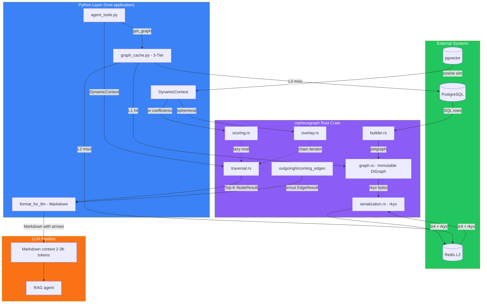
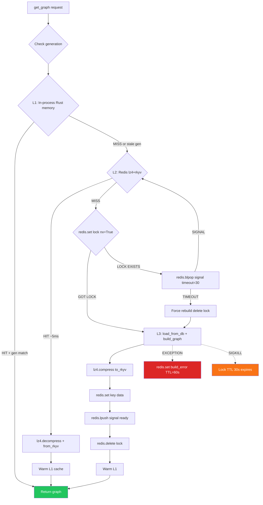
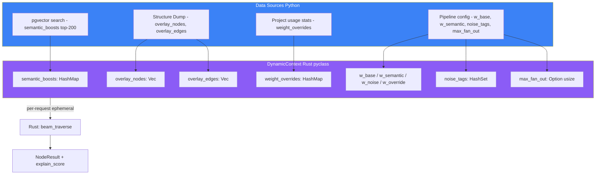
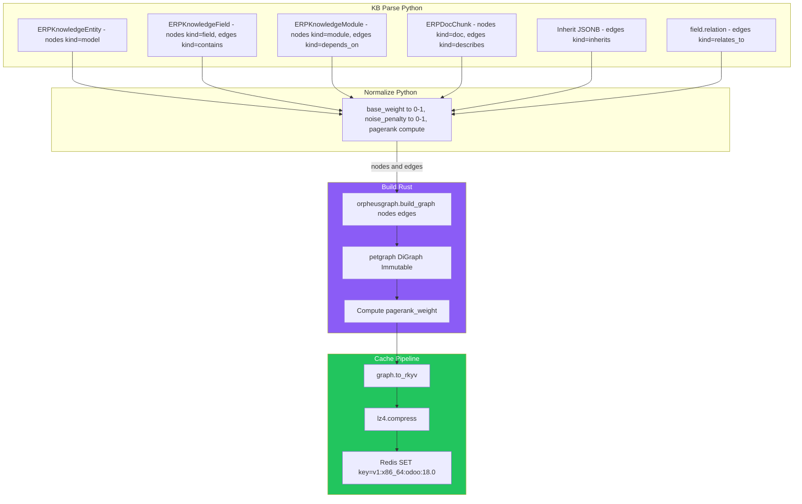
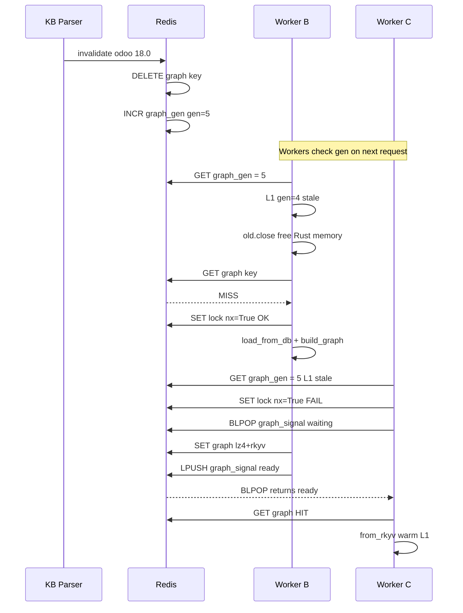
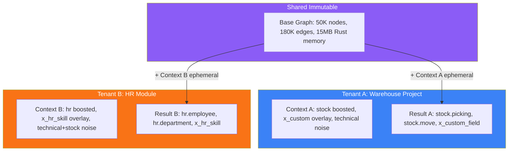

# orpheusgraph — Architecture Diagrams

## 1. High-Level Overview (Low Detail)

---

## 2. 3-Tier Cache Flow (Detailed)

---

## 3. Beam Search Traversal Pipeline (Detailed)

```mermaid
flowchart LR
    START["Start node: sale.order"] --> LEVEL1

    subgraph LEVEL1["Level 1 depth=1"]
        N1["Get neighbors base+overlay"]
        F1["Filter max_fan_out + pagerank"]
        S1["Score: W = base+sem+ovr x 1-noise"]
        T1["Sort Top-K=5"]
    end

    N1 --> F1 --> S1 --> T1

    T1 --> LEVEL2

    subgraph LEVEL2["Level 2 depth=2"]
        N2["Neighbors of Top-5"]
        F2["Filter"]
        S2["Score lazy"]
        T2["Top-K=5"]
    end

    N2 --> F2 --> S2 --> T2

    T2 --> LEVEL3

    subgraph LEVEL3["Level 3 depth=3"]
        N3["Neighbors of Top-5"]
        F3["Filter"]
        S3["Score lazy"]
        T3["Top-K=5"]
    end

    N3 --> F3 --> S3 --> T3

    T3 --> RESULT["Result: 15 nodes 2-3K tokens"]

    style RESULT fill:#22c55e,color:#fff
```

---

## 4. DynamicContext Composition (Detailed)

---

## 5. Graph Build Pipeline (Detailed)

---

## 6. Invalidation & Generation Flow

---

## 7. Flyweight: Tenant Isolation

